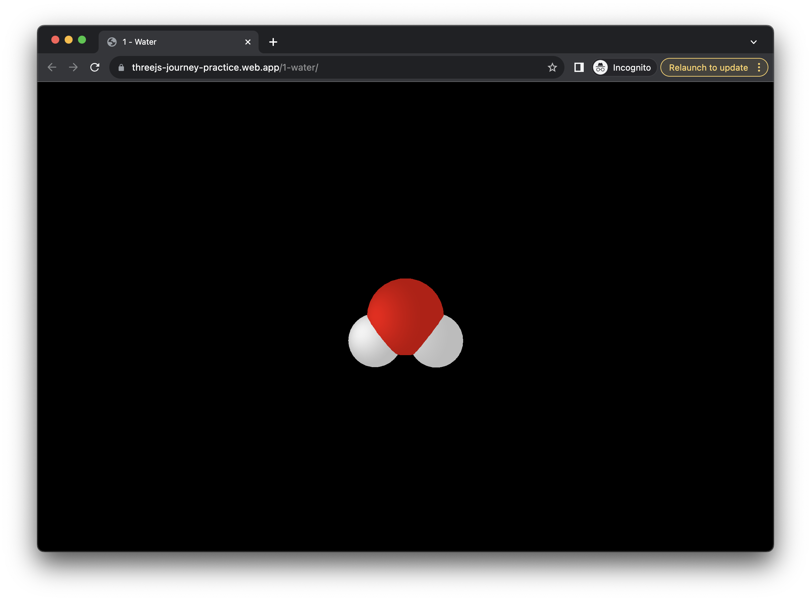
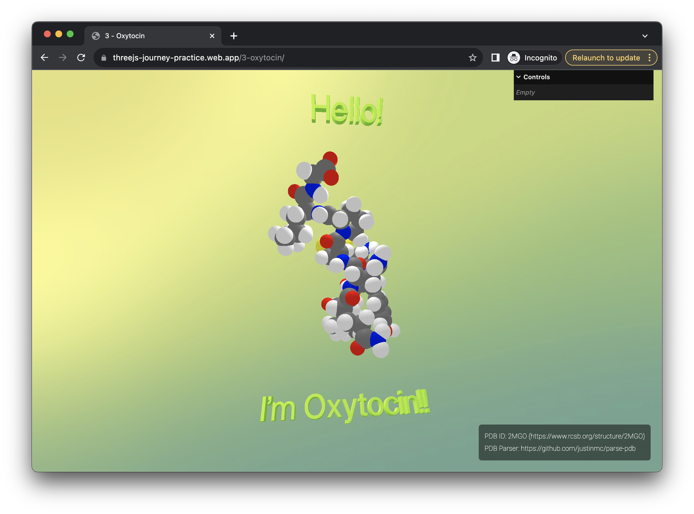

# ThreeJS Deliberate Practices

I've wanted to learn [ThreeJS](https://threejs.org/) since seeing that it's
possible to [make Crossy Road in Javascript](https://github.com/EvanBacon/Expo-Crossy-Road).

So, during the first half of my batch at [Recurse Center](https://www.recurse.com/),
I jumped into the [ThreeJS Journey course](https://threejs-journey.com/).

As I go through the course, each day, I also try to come up with a mini project
to practice what I've learned. This repo is a collection of those mini projects.

## 1 - Water

## 2 - Benzene

## 3 - Oxytocin

