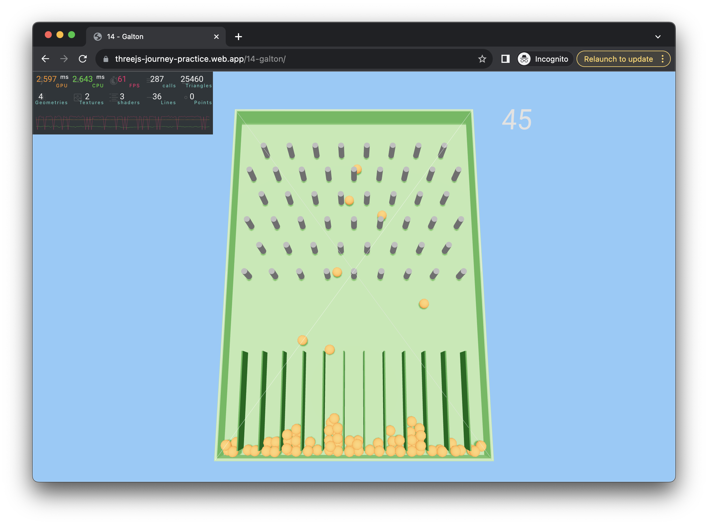

# ThreeJS Deliberate Practices

I've wanted to learn [ThreeJS](https://threejs.org/) since seeing that it's
possible to [make Crossy Road in Javascript](https://github.com/EvanBacon/Expo-Crossy-Road)!

So, during the first half of my batch at [Recurse Center](https://www.recurse.com/),
I jumped into the [ThreeJS Journey course](https://threejs-journey.com/).

As I go through the course, each day, I also try to come up with a mini project
to practice what I've learned. This repo is a collection of those mini projects.

## 1 - Water

[https://threejs-journey-practice.web.app/1-water/](https://threejs-journey-practice.web.app/1-water/)

## 2 - Benzene

[https://threejs-journey-practice.web.app/2-benzene/](https://threejs-journey-practice.web.app/2-benzene/)

## 3 - Oxytocin

[https://threejs-journey-practice.web.app/3-oxytocin/](https://threejs-journey-practice.web.app/3-oxytocin/)

## 4 - Evolution

[https://threejs-journey-practice.web.app/4-evolution/](https://threejs-journey-practice.web.app/4-evolution/)

## 5 - Rain

[https://threejs-journey-practice.web.app/5-rain/](https://threejs-journey-practice.web.app/5-rain/)

## 6 - MATLAB

[https://threejs-journey-practice.web.app/6-matlab/](https://threejs-journey-practice.web.app/6-matlab/)

## 7 - Moonlight

[https://threejs-journey-practice.web.app/7-moonlight/](https://threejs-journey-practice.web.app/7-moonlight/)

## 8 - Smoke

[https://threejs-journey-practice.web.app/8-smoke/](https://threejs-journey-practice.web.app/8-smoke/)

Based on [Book of Shaders, Chapter 13](https://thebookofshaders.com/13/).

## 9 - Breathe

[https://threejs-journey-practice.web.app/9-breathe/](https://threejs-journey-practice.web.app/9-breathe/)

## 10 - Caffeine

[https://threejs-journey-practice.web.app/10-caffeine/](https://threejs-journey-practice.web.app/10-caffeine/)

## 11 - Canon

[https://threejs-journey-practice.web.app/11-canon/](https://threejs-journey-practice.web.app/11-canon/)

Based on React Three Fiber's ["Simple audio analyser"](https://docs.pmnd.rs/react-three-fiber/getting-started/examples) example.

## 12 - Pets

[https://threejs-journey-practice.web.app/12-pets/](https://threejs-journey-practice.web.app/12-pets/)

## 13 - Fine

[https://threejs-journey-practice.web.app/13-fine/](https://threejs-journey-practice.web.app/13-fine/)

## 14 - Galton

[https://threejs-journey-practice.web.app/14-galton/](https://threejs-journey-practice.web.app/14-galton/)

A simulated version of the [Galton Board](https://en.wikipedia.org/wiki/Galton_board).

## 15 - Food

[https://threejs-journey-practice.web.app/15-food/](https://threejs-journey-practice.web.app/15-food/)

